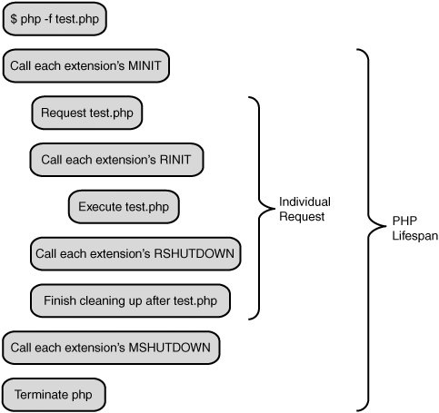
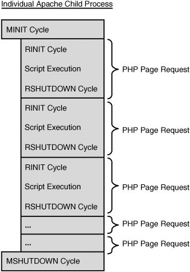
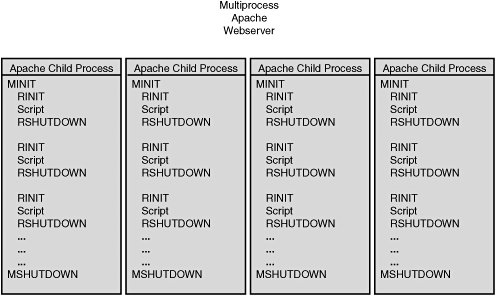
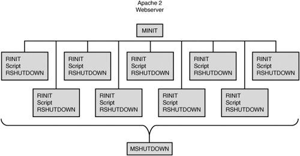

===================
第一章: PHP生命周期
===================

.. highlight:: php
.. IN A COMMON WEB SERVER ENVIRONMENT, YOU'LL NEVER explicitly start the PHP interpreter; you'll start Apache or some other web server that will load PHP and process scripts as neededthat is, as .php documents are requested.

在常见的web服务器环境中, 你从来不会显式的启动PHP解释器; 你将会启动Apache或者其他web服务器来加载PHP并且来解析PHP脚本

.. It All Starts with the SAPI
.. ===========================

一切从SAPI开始
==============

.. Though it may look very different, the CLI binary actually behaves just the same way. A php command, entered at the system prompt starts up the "command line sapi," which acts like a miniweb server designed to service a single request. When the script is done running, this miniPHP-web server shuts down and returns control to the shell.

尽管看起来很不一样, 但是PHP的CLI模式实际上(与常见的web服务器中)没有差别. 在命令提示符下的敲了一条PHP命令, 实际上启动了command line sapi, 等同于一个专门为单次请求服务的小型web服务器. 当脚本运行结束的时候, 这个小服务器会关掉并且把控制权还给shell.

启动和关闭
==========

.. This startup and shutdown process happens in two separate startup phases and two separate shutdown phases. One cycle is for the PHP interpreter as a whole to perform an initial setup of structures and values that will persist for the life of the SAPI. The second is for transient settings that only last as long as a single page request.

.. During the initial startup, before any request has been made, PHP calls every extension's MINIT (Module Initialization) method. Here, extensions are expected to declare constants, define classes, and register resource, stream, and filter handlers that all future script requests will use. Features such as these, which are designed to exist across all requests, are referred to as being persistent.

PHP的启动可以看做是两个不同的时期组成, 关闭也是. 第一个是PHP解释器整体的启动来初始化数据结构和各种值, 这些值和数据结构会贯穿SAPI的整个生命周期. 第二个是每当一个请求过来, 只针对于当前请求的设定/值.

在PHP解释器的初始过程中, 在接受请求之前, PHP会调用每个扩展的\ **MINIT** (模块初始化 *Module Initialization*)方法. 在这里, 扩展会约定俗成的定义常量和类, 注册资源和流, 并且filter handlers that all future script requests will use. 设计的这些功能将会贯穿于所有请求, 即在PHP解释器生命周期内持久化.

.. highlight:: c++

一个常见\ **MINIT**\ 方法的例子\ ::

    /* Initialize the myextension module
     * This will happen immediately upon SAPI startup
     */
    PHP_MINIT_FUNCTION(myextension)
    {
        /* Globals: Chapter 12 */

    #ifdef ZTS
        ts_allocate_id(&myextension_globals_id,
            sizeof(php_myextension_globals),
            (ts_allocate_ctor) myextension_globals_ctor,
            (ts_allocate_dtor) myextension_globals_dtor);
    #else
        myextension_globals_ctor(&myextension_globals TSRMLS_CC);
    #endif

        /* REGISTER_INI_ENTRIES() refers to a global
         * structure that will be covered in
         * Chapter 13 "INI Settings"
         */
        REGISTER_INI_ENTRIES();

        /* define('MYEXT_MEANING', 42); */
        REGISTER_LONG_CONSTANT("MYEXT_MEANING", 42, CONST_CS | CONST_PERSISTENT);
        /* define('MYEXT_FOO', 'bar'); */
        REGISTER_STRING_CONSTANT("MYEXT_FOO", "bar", CONST_CS | CONST_PERSISTENT);

        /* Resources: chapter 9 */
        le_myresource = zend_register_list_destructors_ex(
                        php_myext_myresource_dtor, NULL,
                        "My Resource Type", module_number);
        le_myresource_persist = zend_register_list_destructors_ex(
                        NULL, php_myext_myresource_dtor,
                        "My Resource Type", module_number);

        /* Stream Filters: Chapter 16 */
        if (FAILURE == php_stream_filter_register_factory("myfilter",
                       &php_myextension_filter_factory TSRMLS_CC)) {
            return FAILURE;
        }

        /* Stream Wrappers: Chapter 15 */
        if (FAILURE == php_register_url_stream_wrapper ("myproto",
                       &php_myextension_stream_wrapper TSRMLS_CC)) {
            return FAILURE;
        }

        /* Autoglobals: Chapter 12 */
    #ifdef ZEND_ENGINE_2
        if (zend_register_auto_global("_MYEXTENSION", sizeof("_MYEXTENSION") - 1,
                                                    NULL TSRMLS_CC) == FAILURE) {
            return FAILURE;
        }
        zend_auto_global_disable_jit ("_MYEXTENSION", sizeof("_MYEXTENSION") - 1
                                                         TSRMLS_CC);
    #else
        if (zend_register_auto_global("_MYEXTENSION", sizeof("_MYEXTENSION") - 1
                                                         TSRMLS_CC) == FAILURE) {
            return FAILURE;
        }
    #endif
        return SUCCESS;
    }

.. After a request has been made, PHP sets up an operating environment including a symbol table (where variables are stored) and synchronizes per-directory configuration values. PHP then loops through its extensions again, this time calling each one's RINIT (Request Initialization) method. Here, an extension may reset global variables to default values, prepopulate variables into the script's symbol table, or perform other tasks such as logging the page request to a file. RINIT can be thought of as a kind of auto_prepend_file directive for all scripts requested.

当接到一个请求的时候，PHP建立起包含(保存变量的)符号表并同步每个目录配置项的操作环境. 然后PHP重新遍历所有扩展并执行其\ **RINIT**\ (请求初始化\ *Request Initialization*\ )方法. 

在这个时候， 扩展可以重新设定全局变量、向符号表填充变量或者执行其他任务(比如记录请求内容到一个文件). **RINIT**\ 可以被认为是面向所有请求的某种执行前指令(\ *auto_prepend_file directive*\ ).

一个常见\ **RINIT**\ 方法的例子\ ::

    /* Run at the start of every page request
     */
    PHP_RINIT_FUNCTION(myextension)
    {
        zval *myext_autoglobal;

        /* Initialize the autoglobal variable
         * declared in the MINIT function
         * as an empty array.
         * This is equivalent to performing:
         * $_MYEXTENSION = array();
         */
        ALLOC_INIT_ZVAL(myext_autoglobal);
        array_init(myext_autoglobal);
        zend_hash_add(&EG(symbol_table), "_MYEXTENSION", sizeof("_MYEXTENSION") - 1,
                                    (void**)&myext_autoglobal, sizeof(zval*), NULL);

        return SUCCESS;
    }

.. After a request has completed processing, either by reaching the end of the script file or by exiting through a die() or exit() statement, PHP starts the cleanup process by calling each extension's RSHUTDOWN (Request Shutdown) method. RSHUTDOWN corresponds to auto_append_file in much the same was as RINIT corresponds to auto_prepend_file. The most important difference between RSHUTDOWN and auto_append_file, however, is that RSHUTDOWN will always be executed, whereas a call to die() or exit() inside the userspace script will skip any auto_append_file.

当一个请求处理完成时，不论是执行到了脚本最后一行或者是通过exit()、die()退出, PHP会开始调用各个扩展的\ **RSHUTDOWN**\ (请求关闭\ *Request Shutdown*\ )方法. 如果说\ **RINIT**\ 等同于\ *auto_prepend_file*\ , 那么\ **RSHUTDOWN**\ 就等于\ *auto_append_file*\ . 但是\ *auto_append_file*\ 和\ **RSHUTDOWN**\ 在行为上的最大差异是: \ **RSHUTDOWN**\ 永远会被执行， 而die()和exit()会直接退出而不会执行脚本中的\ *auto_append_file*.

.. Any last minute tasks that need to be performed can be handled in RSHUTDOWN before the symbol table and other resources are destroyed. After all RSHUTDOWN methods have completed, every variable in the symbol table is implicitly unset(), during which all non-persistent resource and object destructors are called in order to free resources gracefully.

\ **RSHUTDOWN**\ 需要对所有任务进行收尾操作， 在此之后符号表和其他资源都会被销毁。在所有的\ **RSHUTDOWN**\ 被执行完毕之后， 每一个在符号表中的变量都会被隐式的销毁, 在此期间，所有的非持久性资源和对象的析构函数都会被调用以便于优雅的释放资源.::

    /* Run at the end of every page request
     */
    PHP_RSHUTDOWN_FUNCTION(myextension)
    {
        zval **myext_autoglobal;

        if (zend_hash_find(&EG(symbol_table), "_MYEXTENSION", sizeof("_MYEXTENSION"),
                                             (void**)&myext_autoglobal) == SUCCESS) {
            /* Do something meaningful
             * with the values of the
             * $_MYEXTENSION array
             */
            php_myextension_handle_values(myext_autoglobal TSRMLS_CC);
        }
        return SUCCESS;
    }

.. Finally, when all requests have been fulfilled and the web server or other SAPI is ready to shut down, PHP loops through each extension's MSHUTDOWN (Module Shutdown) method. This is an extension's last chance to unregister handlers and free persistent memory allocated during the MINIT cycle.

最后， 当所有请求都处理结束并且web服务器或者其他的SAPI想关闭的时候， PHP遍历每个扩展并执行其\ **MSHUTDOWN**\ 方法。

每个扩展会注销其注册的handler并且释放掉在\ **MINIT**\ 里面申请的的跨请求内存使用.::

    /* This module is being unloaded
     * constants and functions will be
     * automatically purged,
     * persistent resources, class entries,
     * and stream handlers must be
     * manually unregistered.
     */
    PHP_MSHUTDOWN_FUNCTION(myextension)
    {
        UNREGISTER_INI_ENTRIES();
        php_unregister_url_stream_wrapper ("myproto" TSRMLS_CC);
        php_stream_filter_unregister_factory ("myfilter" TSRMLS_CC);
        return SUCCESS;
    }

生命周期
========

.. Each PHP instance, whether started from an init script, or from the command line, follows a series of events involving both the Request/Module Init/Shutdown events covered previously, and the actual execution of scripts themselves. How many times, and how frequently each startup and shutdown phase is executed, depends on the SAPI in use. The four most common SAPI configurations are CLI/CGI, Multiprocess Module, Multithreaded Module, and Embedded.

每个PHP实例， 不论是从一个\ *init*\ 脚本，还是从命令行启动，都遵循前面所述的 Request/Module Init/Shutdown事件执行流程. 宿主如何使用SAPI决定了具体执行策略(Request/Module Init/Shutdown执行多少次， 执行频率). 

四种最常见的SAPI模型是: 

    * CLI/CGI
    * 多进程模型
    * 多线程模型
    * 嵌入式模型

-----------
CLI生命周期
-----------

.. The CLI (and CGI) SAPI is fairly unique in its single-request life cycle; however, the Module versus Requests steps are still cycles in discrete loops. Figure 1.1 shows the progression of the PHP interpreter when called from the command line for the script test.php.

CLI(和CGI) SAPI模型是非常特殊的， 因为它的生命周期就是一个请求的跨度; 但是Module和Request步骤仍然是分离执行. 

图示1.1展示了PHP CLI在执行test.php时是如何工作的.

    图示1.1 Request周期 VS 引擎周期

------------------
多进程模型生命周期
------------------

.. The most common configuration of PHP embedded into a web server is using PHP built as an APXS module for Apache 1, or Apache 2 using the Pre-fork MPM. Many other web server configurations fit into this same category, which will be referred to as the multiprocess model through the rest of this book.

PHP最常见的使用方式是内嵌于web服务器内部(apache1.x时代编为APXS的模块, apache2.x时代使用Pre-fork MPM). 其他web服务器也差不多是这种模式. 

之所以被叫做多进程模型， 是因为Apache启动的时候会立即fork出几个子进程，每个子进程会拥有独立的进程空间和函数. 在一个给定的子进程中, PHP实例的生命周期如下图所示. 跟图示1.1的唯一区别就是在\ **MINIT/MSHUTDOWN**\ 之间会可以多个Request.

.. It's called the multiprocess model because when Apache starts up, it immediately forks several child processes, each of which has its own process space and functions independently from each another. Within a given child, the life cycle of that PHP instance looks immediately familiar as shown in Figure 1.2. The only variation here is that multiple requests are sandwiched between a single MINIT/MSHUTDOWN pair.

    图示1.2 独立进程的生命周期

.. This model does not allow any one child to be aware of data owned by another child, although it does allow children to die and be replaced at will without compromising the stability of any other child.

因为多进程模型是fork出多个子进程， 所以子进程之间是无法互相影响的. 如下图所示

    图示1.3 多进程模型生命周期

------------------
多线程模型生命周期
------------------

.. Increasingly, PHP is being seen in a number of multithreaded web server configurations such as the ISAPI interface to IIS and the Apache 2 Worker MPM. Under a multithreaded web server only one process runs at any given time, but multiple threads execute within that process space simultaneously. This allows several bits of overhead, including the repeated calls to MINIT/MSHUTDOWN to be avoided, true global data to be allocated and initialized only once, and potentially opens the door for multiple requests to deterministically share information. Figure 1.4 shows the parallel process flow that occurs within PHP when run from a multithreaded web server such as Apache 2.

随着时代的发展， PHP可以多线程的运行在IIS的ISAPI和Apache2的Worker MPM模式下. i

一个多线程web服务器可以只启动一个进程， 但是有多个线程在同时处理请求. 

这样可以省去重复调用\ ``MINIT/MSHUTDOWN``\ 的开销, 节约内存空间和实现请求间数据共享. 

下图以Apache2为例展示了多线程web服务器的并行处理PHP请求

    图示1.4 多线程模型生命周期

------------------
嵌入式模型生命周期
------------------

.. Recalling that the Embed SAPI is just another SAPI implementation following the same rules as the CLI, APXS, or ISAPI interfaces, it's easy to imagine that the life cycle of a request will follow the same basic path: Module Init => Request Init => Request => Request Shutdown => Module Shutdown. Indeed, the Embed SAPI follows each of these steps in perfect time with its siblings.

嵌入式SAPI只是一种实现， 和CLI/CGI, APXS, ISAPI接口一样， 遵循相同生命周期: 

模块初始化 => 请求初始化 => 处理请求 => 请求结束 => 模块结束

.. What makes the Embed SAPI appear unique is that the request may be fed in multiple script segments that function as part of a single whole request. Control will also pass back and forth between PHP and the calling application multiple times under most configurations.

嵌入式SAPI看起来比较独特的地方是可以将PHP嵌入到容器中去， 并且在处理请求的时候被当做脚本的一部分. 

Zend线程安全
============

在PHP早期, 作为一个单独的CGI进程，并没有做线程安全. 可以随意定义全局变量, 初始化之后就可以随意访问和修改. 任何没有正确清理的资源都可以在CGI进程结束的时候释放.

后来, PHP被嵌入到像Apache这样的多进程web服务器中. 一个变量还是可以被定义为全局变量， 只要在每个请求之前正确的初始化并且请求之后正确清理掉就没有问题， 因为是顺序请求，没有多线程问题. 在这个时代， 实现了请求级别的内存管理(pre-request momery management)以防止内存泄露.

当单进程多线程web服务器出现的时候, PHP就需要管理全局资源了， 所以抽象了一个新层级: \ **TSRM**\ (*Thread Safe Resource Management*)

----------------------
线程安全 VS 非线程安全
----------------------

在一个简单的没有使用线程的程序中，你可能会倾向于把全局变量声明在源文件的顶端，编译器会自动的为它分配内存。

在多线程程序中， 每个线程会需要自己的线程空间, 这就需要给每个线程分配单独的内存。

----------------
线程安全的资源池
----------------

在一个扩展的\ **MINIT**\ 阶段, 扩展通过调用(一次或多次)\ ``ts_allocate_id()``\ 来通知\ **TSRM**\ 自身需要多少资源。

TSRM会记住资源申请量并且返回一个新的、独一无二的标示符用于标识资源在资源池中的位置\ ::

    typedef struct {
        int sampleint;
        char *samplestring;
    } php_sample_globals;
    int sample_globals_id;
    PHP_MINIT_FUNCTION(sample)
    {
        ts_allocate_id(&sample_globals_id,
            sizeof(php_sample_globals),
            (ts_allocate_ctor) php_sample_globals_ctor,
            (ts_allocate_dtor) php_sample_globals_dtor);
        return SUCCESS;
    }

当一个请求中需要访问这些数据的时候， 扩展会要求TSRM返回当前资源池的指针, 加上由\ ``ts_allocate_id()``\ 生成的偏移量。

换句话说, 依据代码流程， 由之前的\ **MINIT**\ ，你可能会看到 \ ``SAMPLE_G(sampleint) = 5``\ 。

线程安全的编译会依据宏展开成\ ::

    (((php_sample_globals*)(*((void ***)tsrm_ls))[sample_globals_id-1])->sampleint = 5;

如果你看不懂的话，不必担心。这都是PHP API内部整合好的， 很多开发者从来都没去看是如何实现的。

--------------------
当不是线程安全的时候
--------------------

因为线程安全的PHP在访问全局资源的时候需要检查是否越界，所以非线程安全的PHP会运行的更快。 毕竟非线程安全PHP的全局资源的地址是在编译的时候就已经确定了的。

考虑之前的例子， 下面的代码是非线程安全的\ ::
    
    typedef struct {
        int sampleint;
        char *samplestring;
    } php_sample_globals;
    php_sample_globals sample_globals;
    PHP_MINIT_FUNCTION(sample)
    {
        php_sample_globals_ctor(&sample_globals TSRMLS_CC);
        return SUCCESS;
    }

.. The first thing you'll notice here is that rather than declaring an int to identify a reference to a globals struct declared elsewhere, you're simply defining the structure right in the process's global scope. This means that the SAMPLE_G(sampleint) = 5; statement from before only needs to expand out as sample_globals.sampleint = 5;. Simple, fast, and efficient.

相比之前定义一个整数值来标识其他地方定义的一个全局结构体， 这里简单的定义了一个全局可见的结构体。

这意味着之前的\ ``SAMPLE_G(sampleint) = 5``\ 只需要展开为\ ``sample_globals.sampleint = 5``\ , 简单、快速、有效。

非线程化的构建作为独立进程， 在意外请求的情况下也是有优势的， 它不会因为一个会导致异常的请求就使整个web服务器宕机。

事实上， Apache的\ ``MaxRequestsPerChild``\ 指令就是为了吸取这个优点而设计的, 定时重启是保证服务稳定的重要举措。

----------------
未定的全局访问
----------------

当你创建一个扩展的时候， 你无法得知环境是否是线程安全。幸运的是, 你会用到的标准头文件中定义了\ ``ZTS``\ 预处理标识符。

当PHP构建为线程安全或者启用了\ ``enable-maintainer-zts``\ 选项， 这个值会自动定义并且可以和常用指令集(比如\ *#ifdef ZTS*\ )一块测试。

就像你刚才所看到的， 只有当PHP构建为线程安全和资源池真正存在的时候，向资源池申请资源才符合逻辑。这就是为什么之前的例子需要检查\ ``ZTS``\ , 而且还存在非ZTS的代码。

在\ ``PHP_MINIT_FUNCTION(myextension)``\ 例子中， \ ``#ifdef ZTS``\ 用来判断并调用正确的全局初始化代码。

线程安全模式下使用\ ``ts_allocate_id()``\ 来构建\ ``myextension_globals_id``\ 变量, 而在非线程安全模式下直接初始化了\ ``myextension_globals``\ 。你应该在扩展源代码中使用宏(\ *Zend macro*\ )来定义这两个变量， 宏会自动测试ZTS并根据是否启用ZTS来定义合适的变量。

当访问全局变量的时候， 你需要用一个自定义宏(比如上面所说的SAMPLE_G())。 在第12章中， 你将会学习如何根据是否开始ZTS来定义宏展开。

------------------
务必要兼容线程安全
------------------

通常情况下PHP的构建为非线程安全， 而只有在SAPI需要(线程安全)或者configure的时候显式指明的时候才会启用线程安全。

基于速度和进程隔离的考虑， 你可能会觉得为毛有人会故意启用线程安全， 毕竟根本不需要TSRM。

绝大多数情况下， 线程安全的扩展可以保证运行在所有环境下。

当启用线程安全时， 很多内部函数会加上一个叫做\ **tsrm_ls**\ 的特殊指针。 这个指针允许PHP区分数据到底属于哪个线程。在前面的代码中这玩意被用在线程安全的\ ``SAMPLE_G()``\ 宏之中。
